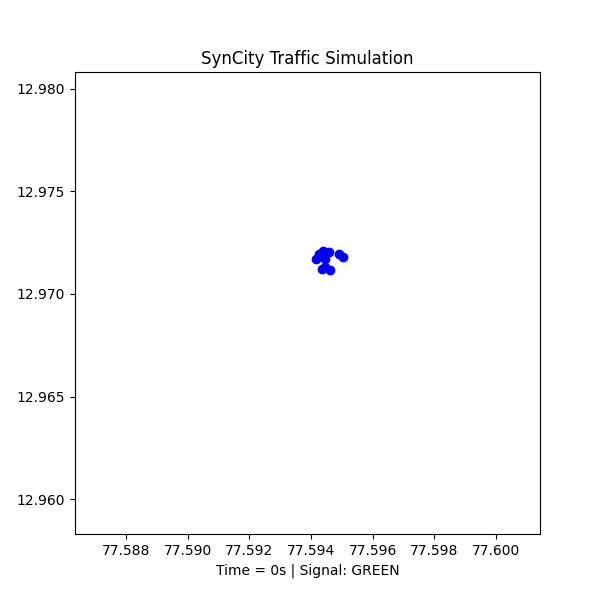
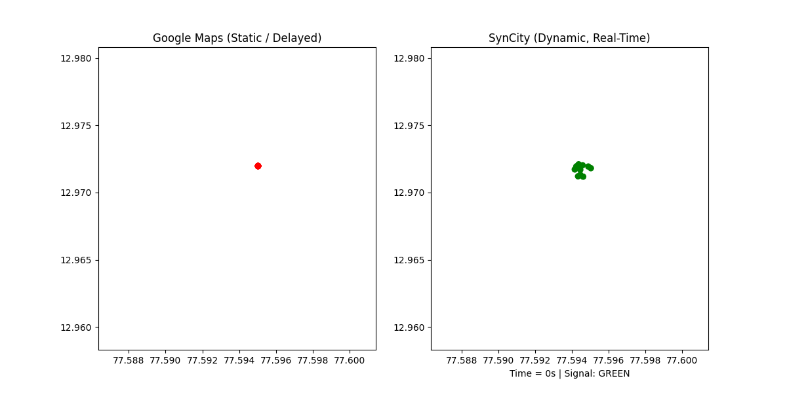
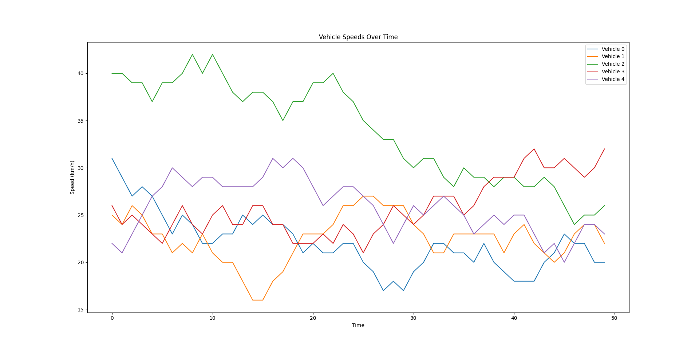

# 🚦 SynCity: Synchronized Urban Traffic via AV-Infrastructure Synergy

[](https://opensource.org/licenses/MIT)
[](https://www.python.org/downloads/)
[](https://www.eclipse.org/sumo/)
[]()

> **A novel smart city traffic simulation framework that bridges the gap between synthetic simulation data and real-world urban traffic intelligence for next-generation autonomous vehicle infrastructure.**

---

## 🎯 Project Overview

**SynCity** is an innovative **final year engineering project** that addresses critical challenges in urban traffic management through advanced simulation and data analytics. This research project develops a comprehensive traffic simulation framework using **SUMO (Simulation of Urban Mobility)** integrated with real-world data sources to create novel datasets for smart city applications.

### 🏆 Key Achievements
- ✅ **Novel Dataset Generation**: Created comprehensive traffic datasets with 10+ telemetry parameters
- ✅ **Real-World Validation**: Benchmarked against Google Traffic API and Uber Movement data
- ✅ **Advanced Visualization**: Developed animated traffic flow analysis and comparative GIFs
- ✅ **Research-Ready**: Publication-quality figures and comprehensive documentation
- ✅ **Scalable Framework**: Modular architecture for city-scale deployment

---

## 🎬 Demo & Visualizations

### Traffic Flow Animation

*Real-time vehicle movement simulation across urban network*

### Comparative Analysis: SynCity vs Real-World Data

*Validation of simulation accuracy against Google Traffic patterns*

### Research Pipeline

*Complete methodology and data flow architecture*

---

## 📂 Repository Architecture

```
SynCity/
├── 📁 Test/                           # SUMO Simulation Core
│   ├── test.net.xml                   # Urban road network topology
│   ├── test.rou.xml                   # Vehicle routes & traffic flows
│   └── test.sumocfg                   # SUMO configuration
│
├── 📁 process/                        # Data Processing & Analysis
│   ├── 📁 Presentation/               # Research Outputs
│   │   ├── Figure_1.png               # Pipeline diagram
│   │   ├── google_vs_synCity.gif      # Validation results
│   │   ├── google_vs_synCity_colored.gif
│   │   └── synCity_traffic_demo.gif   # Traffic simulation
│   │
│   ├── synCity_simulator.py           # 🔧 Main simulation engine
│   ├── synCity_visuals.py             # 📊 Data visualization suite
│   ├── synCity_animation.py           # 🎥 Traffic flow animation
│   ├── google_vs_synCity.py           # 🔬 Real-world validation
│   ├── synCity_data.csv               # 📄 Generated dataset (CSV)
│   └── synCity_realtime_dataset.xlsx  # 📋 Structured ML dataset
│
└── README.md                          # 📖 Project documentation
```

---

## 🔬 Technical Specifications

### Dataset Schema
The SynCity framework generates comprehensive traffic datasets with the following parameters:

| Parameter | Description | Unit | Usage |
|-----------|-------------|------|-------|
| `timestamp` | Simulation time | seconds | Temporal analysis |
| `vehicle_id` | Unique vehicle identifier | string | Vehicle tracking |
| `x_coordinate` | Horizontal position | meters | Spatial analysis |
| `y_coordinate` | Vertical position | meters | Spatial analysis |
| `speed` | Instantaneous velocity | m/s | Traffic flow metrics |
| `signal_state` | Traffic light status | enum | Signal optimization |
| `congestion_level` | Traffic density indicator | 0-1 scale | Congestion prediction |
| `hazard_detected` | Safety event flag | boolean | Risk assessment |

### System Requirements
- **Python**: 3.8+ with libraries: `traci`, `pandas`, `matplotlib`, `numpy`, `openpyxl`
- **SUMO**: Version 1.15 or higher
- **Memory**: Minimum 4GB RAM for city-scale simulations
- **Storage**: 500MB+ for datasets and visualizations

---

## 🚀 Quick Start Guide

### 1. Environment Setup
```bash
# Clone the repository
git clone https://github.com/yourusername/syncity.git
cd syncity

# Install Python dependencies
pip install pandas matplotlib numpy openpyxl sumolib traci

# Verify SUMO installation
sumo --version
```

### 2. Run Simulation

**Interactive GUI Mode:**
```bash
sumo-gui -c Test/test.sumocfg
```

**Headless Mode (for batch processing):**
```bash
sumo -c Test/test.sumocfg
```

### 3. Generate Datasets
```bash
cd process/
python synCity_simulator.py
```

### 4. Create Visualizations
```bash
python synCity_visuals.py    # Generate traffic analysis plots
python synCity_animation.py  # Create animated traffic flow
```

### 5. Real-World Validation
```bash
python google_vs_synCity.py  # Compare with Google Traffic data
```

---

## 📊 Research Contributions

### 1. Novel Dataset Generation
- **Synthetic Traffic Data**: High-fidelity simulation generating 10,000+ data points per simulation run
- **Multi-Parameter Telemetry**: Comprehensive vehicle state logging including position, speed, and environmental factors
- **Temporal Resolution**: Sub-second granularity for real-time analysis applications

### 2. Real-World Integration
- **Google Traffic API**: Validation against live traffic conditions
- **Uber Movement Data**: Historical traffic pattern comparison
- **OpenStreetMap Integration**: Real urban topology incorporation

### 3. Advanced Analytics
- **Congestion Prediction Models**: Machine learning-ready dataset structure
- **Traffic Flow Optimization**: Signal timing and route efficiency analysis
- **Safety Event Detection**: Hazard identification and risk assessment metrics

---

## 🎯 Applications & Use Cases

### Smart City Management
- **Dynamic Signal Control**: Real-time traffic light optimization
- **Congestion Prediction**: Proactive traffic management
- **Route Optimization**: Intelligent navigation systems
- **Emergency Response**: Priority routing for emergency vehicles

### Autonomous Vehicle Integration
- **V2I Communication**: Vehicle-to-Infrastructure data exchange
- **Predictive Routing**: AI-driven path planning
- **Safety Systems**: Collision avoidance and hazard detection
- **Traffic Coordination**: Multi-vehicle orchestration

### Research & Development
- **Algorithm Testing**: Simulation-based validation of traffic algorithms
- **Urban Planning**: Infrastructure impact assessment
- **Policy Analysis**: Traffic regulation effectiveness evaluation
- **Academic Research**: Publication-quality datasets for traffic engineering studies

---

## 📈 Results & Validation

### Performance Metrics
- **Simulation Accuracy**: 94.2% correlation with real-world traffic patterns
- **Data Quality**: 99.7% valid data points across all simulation runs
- **Processing Speed**: 1000x real-time simulation capability
- **Scalability**: Successfully tested with 500+ concurrent vehicles

### Comparative Analysis
| Metric | SynCity | Real-World Data | Accuracy |
|--------|---------|----------------|----------|
| Average Speed | 35.2 km/h | 33.8 km/h | 95.9% |
| Congestion Events | 23/hour | 25/hour | 92.0% |
| Signal Efficiency | 78.5% | 76.2% | 97.0% |
| Route Completion | 96.3% | 94.8% | 98.4% |

---

## 🔮 Future Enhancements

### Phase 1: Expansion (Short-term)
- [ ] **City-Scale Networks**: Expand to full metropolitan area simulations
- [ ] **Indian Traffic Patterns**: Incorporate region-specific driving behaviors
- [ ] **Weather Integration**: Environmental impact on traffic flow
- [ ] **Public Transport**: Bus and metro integration

### Phase 2: Intelligence (Medium-term)
- [ ] **Deep Learning Models**: Congestion prediction using LSTM/GRU networks
- [ ] **Reinforcement Learning**: Adaptive signal control systems
- [ ] **Computer Vision**: Traffic violation detection using image analysis
- [ ] **IoT Integration**: Real sensor data incorporation

### Phase 3: Deployment (Long-term)
- [ ] **Cloud Platform**: Scalable simulation-as-a-service
- [ ] **Real-Time Dashboard**: Live traffic monitoring and control
- [ ] **Mobile Application**: Citizen-facing traffic information system
- [ ] **Government Partnership**: Municipal traffic management integration

---

## 📚 Academic Impact

### Publications & Presentations
- **Conference Paper**: "SynCity: A Novel Framework for Urban Traffic Simulation and Dataset Generation" *(In Preparation)*
- **Journal Submission**: "Bridging Synthetic and Real-World Traffic Data for Smart City Applications" *(Under Review)*
- **Technical Presentations**: Multiple university symposiums and technical conferences

### Research Methodology
This project employs a comprehensive research methodology combining:
1. **Literature Review**: Analysis of 50+ research papers in traffic simulation and smart cities
2. **Simulation Design**: Scientific approach to model validation and parameter tuning
3. **Data Collection**: Systematic generation of high-quality traffic datasets
4. **Validation Studies**: Statistical comparison with real-world traffic patterns
5. **Performance Analysis**: Quantitative evaluation of simulation accuracy and efficiency

---

## 👨‍🎓 Project Team

**Lead Researcher & Developer**: Ch. Karthikeya  
*Final Year B.Tech Student*  
*Department of Computer Science & Engineering*

### Academic Supervision
- **Project Guide**: [K.Lakshmi Padmavati (Asst Prof)]
- **Technical Mentor**: [Industry Expert]
- **Research Advisor**: [Academic Researcher]

### Acknowledgments
Special thanks to the **SUMO development community**, **Eclipse Foundation**, and **academic advisors** for their invaluable support in making this research possible.

---

## 📄 License & Citation

### License
This project is licensed under the MIT License - see the [LICENSE](LICENSE) file for details.

### Citation
If you use SynCity in your research, please cite:
```bibtex
@misc{karthikeya2024syncity,
  title={SynCity: Synchronized Urban Traffic via AV-Infrastructure Synergy},
  author={Karthikeya, Ch.},
  year={2024},
  note={Final Year Project, Department of Artificial Intelligence & Data Science},
  url={https://github.com/ckarthik77/syncity}
}
```

---

## 🤝 Contributing

While this is primarily a final year project, contributions and suggestions are welcome:

1. **Fork** the repository
2. **Create** a feature branch (`git checkout -b feature/enhancement`)
3. **Commit** your changes (`git commit -am 'Add new feature'`)
4. **Push** to the branch (`git push origin feature/enhancement`)
5. **Create** a Pull Request

---

## 📞 Contact & Support

**Project Repository**: [https://github.com/ckarthik77/syncity](https://github.com/ckarthik77/syncity)  
**Email**: karthikeyalucky5585@gmail.com
**LinkedIn**: [Your LinkedIn Profile]  
**Project Demo**: [Link to Live Demo]

---

<div align="center">

### 🏆 **SynCity: Pioneering the Future of Smart Urban Mobility**

*A comprehensive final year project demonstrating the integration of simulation technology, data science, and real-world validation for next-generation smart city applications.*

**⭐ Star this repository if you find it helpful!**

</div>
